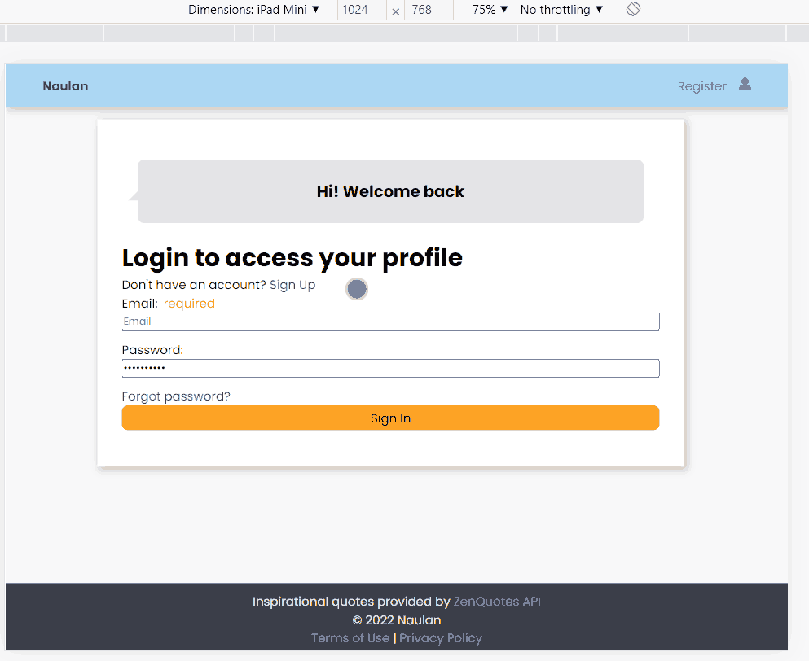
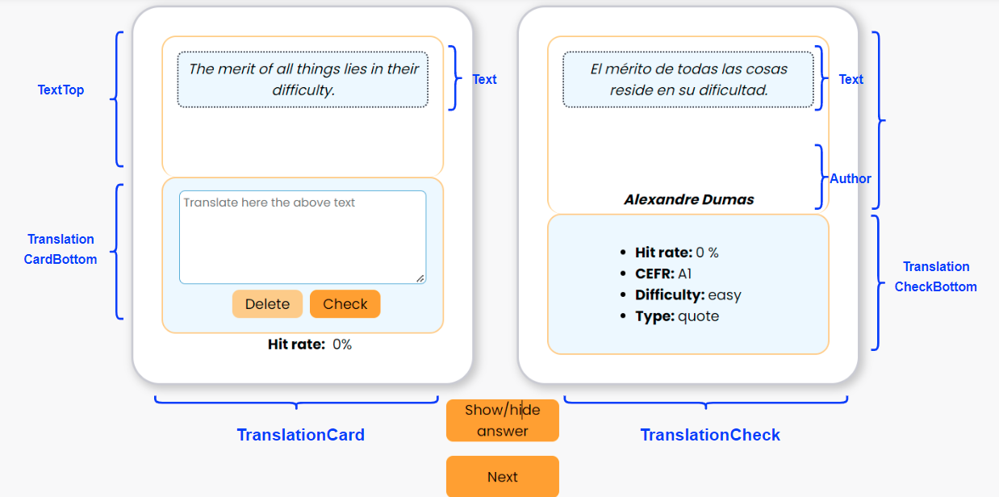
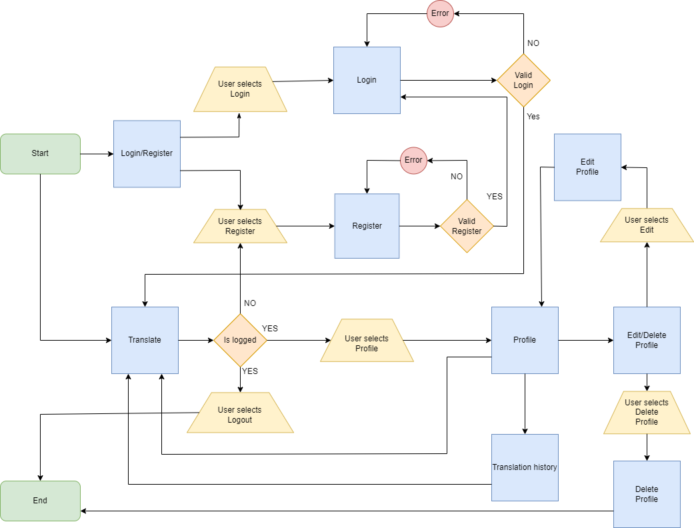
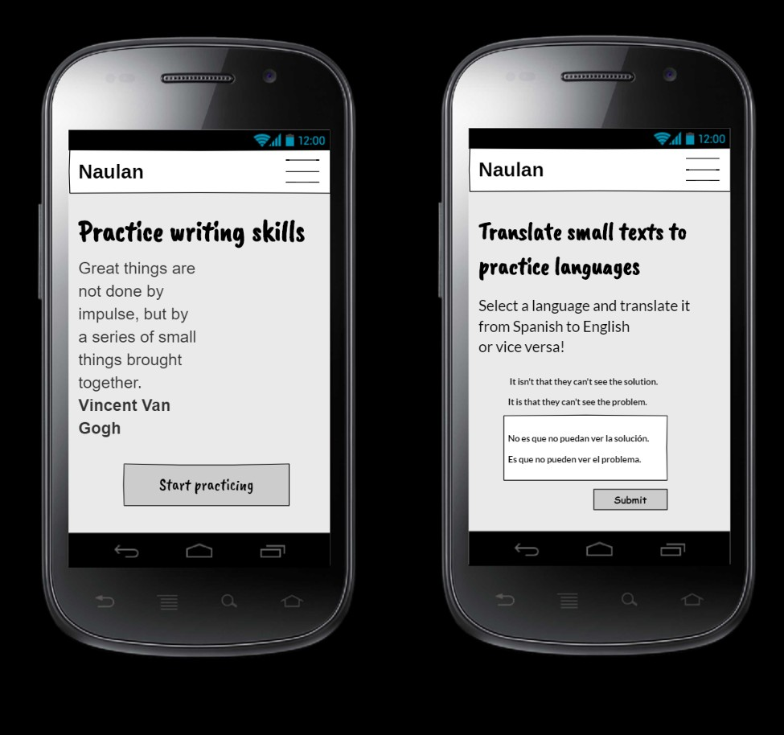
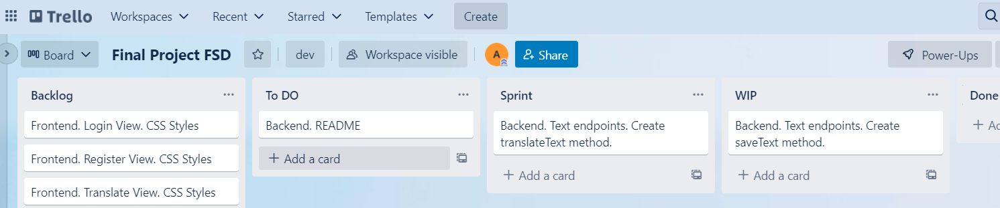

# Languages web application frontend

   

React frontend for the development of a languages web application.

- Backend developed with Laravel PHP Framework: https://github.com/angelgr-com/lan-api

The objective is to create an app for language learning by translating and proofreading short texts, from Spanish to English and vice versa.

## Demo

- The app is deployed using AWS Amplify:
  - https://main.d5ung8q2igeq.amplifyapp.com/

- A quick preview showing web and mobile version:



## Table of contents

  - [Application requirements](#application-requirements)
  - [Technologies used](#technologies-used)
  - [Features 📋](#features-)
    - [Homepage](#homepage)
    - [Header](#header)
    - [Login / Register](#login--register)
    - [Profile](#profile)
    - [Translate En-Es](#translate-en-es)
  - [Making-of 🎬](#making-of-)

## Application requirements

- 🆗 Users must be able to know the application characteristics by visiting the homepage.
- ✅ Users must be able to authenticate themselves to the application by logging in.
- 🆕 Users have to be able to translate texts from English to Spanish or vice versa and receive their hit rate.
- 👩‍💻 Users must be able find details about the text they are translating, by finding its CEFR level, difficulty and type.
- 📋 Users can enter and modify their profile data.
- 🆑 Users must be able to delete their profile data.
- 👋 Users must be able to log out of the web application.

## Technologies used

| Technology                                                   | Description                                                  | Versions                                                     |
| ------------------------------------------------------------ | ------------------------------------------------------------ | ------------------------------------------------------------ |
| [React [reactjs.org]](https://reactjs.org/)                  | A JavaScript library for building user interfaces.           | **react**: 18.1.0, **react-dom**: 18.1.0, **react-icons**: 4.3.1, **react-router-dom**: 6.3.0, **react-scripts**: 5.0.1 |
| [Redux [redux.js.org]](https://redux.js.org/)                | A Predictable State Container for JS Apps.                   | **react-redux**: 8.0.1, **redux**: 4.2.0, **redux-localstorage-simple**: 2.5.1 |
| [Axios [axios-http.com]](https://axios-http.com/)            | Axios is a promise based HTTP client library.                | **axios**: 0.27.2                                            |
| [Formik [formik.org]](https://formik.org/)                   | React library for building forms.                            | **formik**: 2.2.9                                            |
| [Yup [github.org]](https://github.com/jquense/yup)           | Yup is a schema builder for runtime value parsing and validation. | **yup**: 0.32.11                                             |
| [Styled components [styled-components.com]](https://styled-components.com/) | Allows use of actual CSS syntax inside components and solves selector name collisions. | **styled-components**: 5.3.5                                 |
| [Git-Flow [github.io]](https://danielkummer.github.io/git-flow-cheatsheet/index.html) | A set of git extensions to provide high-level repository operations for Vincent Driessen's branching model |                                                              |
| [AWS Amplify [amazon.com]](https://aws.amazon.com/es/amplify/) | Deploy and host single-page web apps                         |                                                              |

## Features 📋

Some hightlights about the features coded:

### Homepage

https://github.com/angelgr-com/nau-frontend/blob/main/src/pages/Home.js

- It is a **landing page** to showcase app features and encourage users to register.

- **Mobile design** is considered from the beginning, so the app adapts the features card direction into columns when the screen is narrower.

- Feature texts are loaded using **props**:

  ```jsx
  const Home = () => {
    const feature = [
      {
        header: 'Translate small texts to practice languages',
        paragraph: 'Select a language and translate it from Spanish to English or vice versa!',
      },
      {
        header: 'Get immediate results and check your hit rate!',
        paragraph: 'If you register, you will be able to review your translations and their corrections to keep improving.',
      },
      {
        header: 'This is just the beginning...',
        paragraph: 'We will continue to improve the service and will be happy to hear what you are missing.',
      }
    ];
  
    return (
      <Features>
        <Hero />
        <Feature
          header={feature[0].header}
          paragraph={feature[0].paragraph}
          reverse={false}
          />
        <Feature
          header={feature[1].header}
          paragraph={feature[1].paragraph}
          reverse={true}
        />
        <Feature
          header={feature[2].header}
          paragraph={feature[2].paragraph}
        />
      </Features>
    )
  }
  ```

-  In desktop view, **homepage features show a zig-zag design** (one feature description to the right and the next to the left).

  - It is achieved changing the flex-direction property (css is in the same component thanks to the use of **styled-components**)

    ```css
    const Features = styled.div`
      align-items: center;
      display: flex;
      flex-direction: column;
      justify-items: center;
      & :nth-child(odd){
        flex-direction: row-reverse;
      }
      & :nth-child(1){
        flex-direction: column;
      }
      @media only Screen and (max-width: 48em) {
        & :nth-child(odd){
          flex-direction: column;
        }
      }
      @media only Screen and (max-width: 30em) {
        padding: 0.5rem 2rem;
      }
    `;
    ```

### Header

https://github.com/angelgr-com/nau-frontend/blob/main/src/sections/Header.js

- Header is connected to **Redux **to update the user logged in and uses **conditional rendering**.

  ```jsx
  // Render without credentials
    if (!props.credentials?.token) {
      return (
        <Headers>
          <Container>
            <Logos href="/">Naulan</Logos>
            <Navs>
              <a href="/register">Register</a>
              <Buttons href="/login"><FaUserAlt /></Buttons>
            </Navs>
          </Container>
        </Headers>
      )
    // Render with credentials 
    } else {
      return (
        <Headers>
          <Container>
            <Logos href="/">Naulan</Logos>
            <Navs>
              <Logout onClick={() => logOut()}>Logout</Logout>
              <Buttons href="/profile">
                <Row>
                  <FaUserAlt />
                  <UserName>{props.credentials.user.first_name}</UserName>
                </Row>
              </Buttons>
              {/* <Buttons href="/options"><GrMenu /></Buttons> */}
            </Navs>
          </Container>
        </Headers>
      )
  // ...
  // ...
  export default connect((state) => ({
    credentials: state.credentials
  }))(Header);
  ```

### Login / Register

https://github.com/angelgr-com/nau-frontend/blob/main/src/pages/Login.js

https://github.com/angelgr-com/nau-frontend/blob/main/src/pages/Register.js

- Login and register forms use **Formik **and **Yup** **to validate** user data.

  ```jsx
    return (
      <RegisterSt>
        {/* {<pre>{JSON.stringify(userData, null,2)}</pre>} */}
        <h1>Register to access your profile</h1>
        <p>Already have an account? <a href='/login'>Sign in</a></p>
        <Formik
          initialValues={initialValues}
          validationSchema={validationSchema}
          onSubmit={(values, { setSubmitting }) => {
            setTimeout(() => {
              alert(JSON.stringify(values, null, 2));
              setSubmitting(false);
            }, 400);
          }}
        >
          <Form id="register" method="post" autoComplete="on">
            <Group>
              <LabelGroup>
                <label htmlFor="first_name">First Name: </label>
                <ErrorMessage name="first_name" render={msg => <div style={errorM}>{msg}</div>} />
              </LabelGroup>
              <Field
                as={InputSt}
                autoComplete="given-name"
                name="first_name"
                onInput={(e)=>{fillData(e)}}
                placeholder="First Name"
                type="text"
              />
            </Group>
  ```

  ```jsx
  // Form data validation with Yup
    const validationSchema = Yup.object({
      first_name: Yup.string()
                     .required('Required')
                     .matches(/^([a-z\xC0-\uFFFF]{1,50}[ ºª\-']{0,2}){1,2}$/i, "invalid name")
                     .matches(/^(?!admin)/i, 'admin is not a valid user name')
                     .min(2, "must be at least 2 characters")
                     .max(50),
  ```

- Password confirmation is checked dinamically using a **useEffect** to monitor the state os userData:

  ```jsx
  useEffect(()=>{
      if (userData.password !== userData.password_confirmation) {
        setReportError('The password confirmation does not match');
        setIsWrong(true);
        return;
      } else {
        setIsWrong(false);
      }
    }, [userData]);
    useEffect(()=>{});
  ```

### Profile

https://github.com/angelgr-com/nau-frontend/blob/main/src/pages/Profile.js

- Profile shows a card to complete user's profile. After saving, it will be hidden in the next profile reload.

  - The application checks if user profile is complete by reading from the database.

    ```jsx
    const Profile = (props) => {
      let navigate = useNavigate();
      const [IsProfileIncomplete, setIsProfileIncomplete] = useState(false);
    
      useEffect(()=>{
        async function checkIsProfileComplete() {
          const config = {
            headers: { Authorization: `Bearer ${props.credentials.token}` }
          };
      
          try {
            let res = await axios.get('https://quiet-shelf-00426.herokuapp.com/api/users/profile/complete', config);
            if(res.data.message === 'User is complete') {
              setIsProfileIncomplete(false);
            } else {
              setIsProfileIncomplete(true);
            }
    ```

### Translate En-Es

- The translate page, uses two main components to display the user interface (**TranslationCard **and **TranslationCheck**).

  

- Subcomponents use props to access data.

- Links to check code:

  - [TranslationCard](https://github.com/angelgr-com/nau-frontend/blob/main/src/sections/TranslationCard.js)

    - [TextTop](https://github.com/angelgr-com/nau-frontend/blob/main/src/components/TextTop.js)

      - [Text](https://github.com/angelgr-com/nau-frontend/blob/main/src/components/Text.js)
      - [Author](https://github.com/angelgr-com/nau-frontend/blob/main/src/components/Author.js)

    - [TranslationCardBottom](https://github.com/angelgr-com/nau-frontend/blob/main/src/components/TranslationCardBottom.js)

      - After saving user translation in database, hit rate is saved in **Redux** to access its value from **TranslationCheckBottom**.

      ```jsx
      const saveTranslation = async () => {
          const config = {
            headers: { Authorization: `Bearer ${props.credentials.token}` }
          };
          setIsTextSubmited(true);
          props.dispatch({type: SUBMITED, payload: isTextSubmited});
        
          let body = {
            language: props.language,
            text: userTranslation,
            text_id: props.textid,
          }
      
          try {
            setIsLoading(true);
            let res = await axios.post(
              'https://quiet-shelf-00426.herokuapp.com/api/texts/translation',
              body,
              config
            );
            
            props.dispatch({type: HITRATE, payload: res.data.translation.hit_rate});
            setIsLoading(false);
          } catch (error) {
            console.log('error: ', error.response.data.message);
          }
        }
      
      ```

  - [TranslationCheck](https://github.com/angelgr-com/nau-frontend/blob/main/src/sections/TranslationCheck.js)

    - [TextTop](https://github.com/angelgr-com/nau-frontend/blob/main/src/components/TextTop.js)

      - [Text](https://github.com/angelgr-com/nau-frontend/blob/main/src/components/Text.js)
      - [Author](https://github.com/angelgr-com/nau-frontend/blob/main/src/components/Author.js)

    - [TranslationCheckBottom](https://github.com/angelgr-com/nau-frontend/blob/main/src/components/TranslationCheckBottom.js)

      - TranslationCheckBottom is connected to redux to be able to load the hit rate:

        ```jsx
        export default connect((state) => ({
          credentials: state.credentials,
          textid: state.textid,
          hitrate: state.hitrate,
        }))(TranslationCheckBottom);
        ```

        

## Making-of 🎬

- A user flow was created with [Draw.io](draw.io). It was helpful to plan the application before starting coding:



- Some basic user interface prototyping was made with [Evolus Pencil [evolus.vn]](https://pencil.evolus.vn/):



- And Trello was used to plan and organize tasks:




